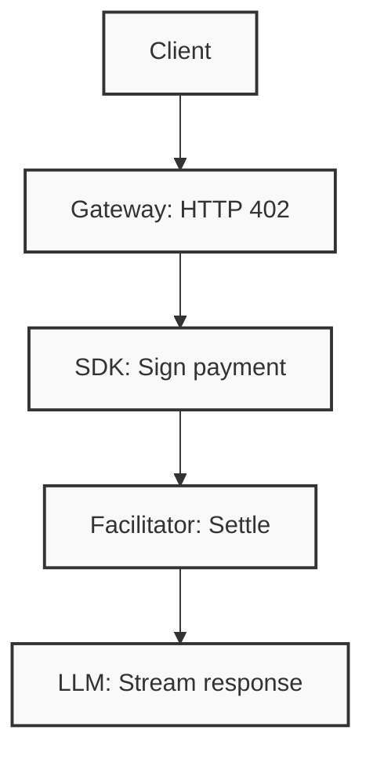

<p align="center">
  
</p>

<h2 align="center">QNTX Chat</h2>

<p align="center">
  Permissionless LLM access via HTTP 402 micropayments.
</p>

<p align="center">
  <a href="https://opensource.org/licenses/BSD-3-Clause"></a>
  
  
  
  
  
</p>

<p align="center">
  <a href="https://chat.qntx.fun">Live Demo</a>&ensp;·&ensp;
  <a href="https://docs.qntx.fun">Documentation</a>&ensp;·&ensp;
  <a href="https://nad.fun/tokens/0x4Daab757f758689Afbb3848A037bd4A2ae107777">Token</a>
</p>

---

## Overview

QNTX Chat is a fully client-side AI chat interface that replaces API keys and subscription plans with per-message USDC micropayments on [Monad](https://monad.xyz).

**No registration. No backend accounts. No vendor lock-in.**

## Architecture



Every interaction follows the same stateless request–payment–response cycle. The client holds no session state; the gateway holds no user credentials.

## Features

- **Multi-model support** — Access GPT-4o, GPT-5.2, Claude, Gemini, Llama, and DeepSeek through a unified interface
- **Image generation** — DALL-E, Flux, and Stable Diffusion endpoints available via the same payment protocol
- **Server-sent events** — Real-time token streaming for all text generation models
- **Autonomous micropayments** — Per-message USDC settlement on Monad with zero manual approval flow
- **Stateless architecture** — No backend accounts, no session persistence, no API key storage

## Developer SDKs

Access any LLM with nothing but a wallet — no API keys, no subscriptions, no vendor lock-in.

### Python

```python
from x402_openai import X402OpenAI
from x402_openai.wallets import EvmWallet

client = X402OpenAI(wallet=EvmWallet(private_key="0x…"))

res = client.chat.completions.create(
    model="openai/gpt-4o-mini",
    messages=[{"role": "user", "content": "Hello!"}],
)
print(res.choices[0].message.content)
```

### TypeScript

```typescript
import { X402OpenAI } from "x402-openai";
import { EvmWallet } from "x402-openai/wallets";

const client = new X402OpenAI({
  wallet: new EvmWallet({ privateKey: "0x…" }),
});

const res = await client.chat.completions.create({
  model: "openai/gpt-4o-mini",
  messages: [{ role: "user", content: "Hello!" }],
});
console.log(res.choices[0]?.message.content);
```

Every request auto-settles on Monad. No registration, no billing dashboard — **just code and a wallet**.

**Repositories:** [`x402-openai-python`](https://github.com/qntx/x402-openai-python) · [`x402-openai-typescript`](https://github.com/qntx/x402-openai-typescript)

## Infrastructure

Built on a fully open-source stack:

- **[`facilitator`](https://github.com/qntx/facilitator)** — Settlement server for on-chain payment verification
- **[`r402`](https://github.com/qntx/r402)** — Rust implementation of the x402 protocol
- **[`kobe`](https://github.com/qntx/kobe)** — Multi-chain wallet derivation (`no_std` Rust)
- **[`ra2a`](https://github.com/qntx/ra2a)** — Agent-to-agent communication protocol (Rust)
- **[`erc8004`](https://github.com/qntx/erc8004)** — Trustless agent identity standard (ERC-8004)

## Token Economics

The **QNTX** token ([nad.fun](https://nad.fun/tokens/0x4Daab757f758689Afbb3848A037bd4A2ae107777)) is wired into the payment loop. Holding QNTX grants **on-chain verified tiered discounts** applied at settlement time:

| Required Balance | Discount |
| --- | --- |
| ≥ 1 | 1 % |
| ≥ 10,000 | 3 % |
| ≥ 50,000 | 5 % |
| ≥ 100,000 | 8 % |
| ≥ 500,000 | 12 % |
| ≥ 1,000,000 | 18 % |
| ≥ 5,000,000 | 25 % |
| ≥ 10,000,000 | 35 % |
| ≥ 50,000,000 | 45 % |
| ≥ 100,000,000 | 50 % |

Discount tiers are read directly from the caller's QNTX balance on Monad — no off-chain lookup, no trust assumptions.

Trading activity on nad.fun generates [creator fees](https://nad-fun.gitbook.io/nad.fun) (30 % of post-graduation LP fees) that flow back to the project.

## License

This project is licensed under the BSD 3-Clause License - see the [LICENSE](LICENSE) file for details.
